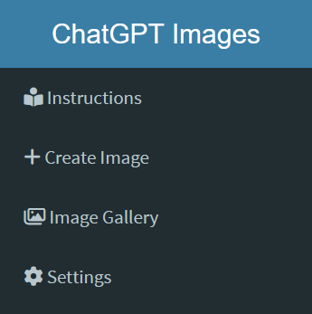
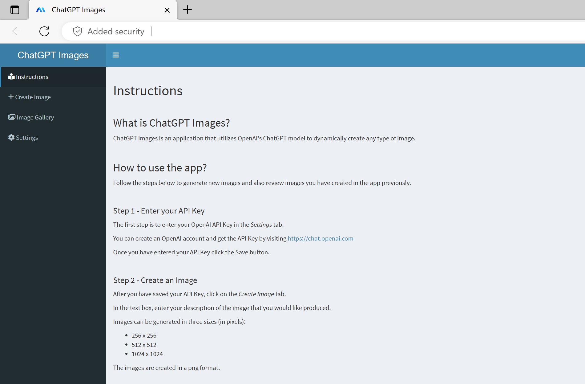
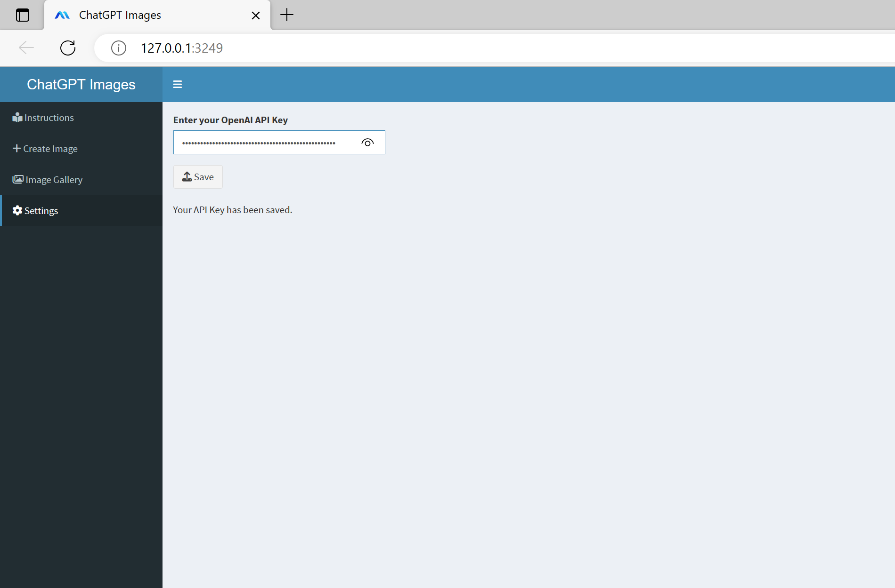
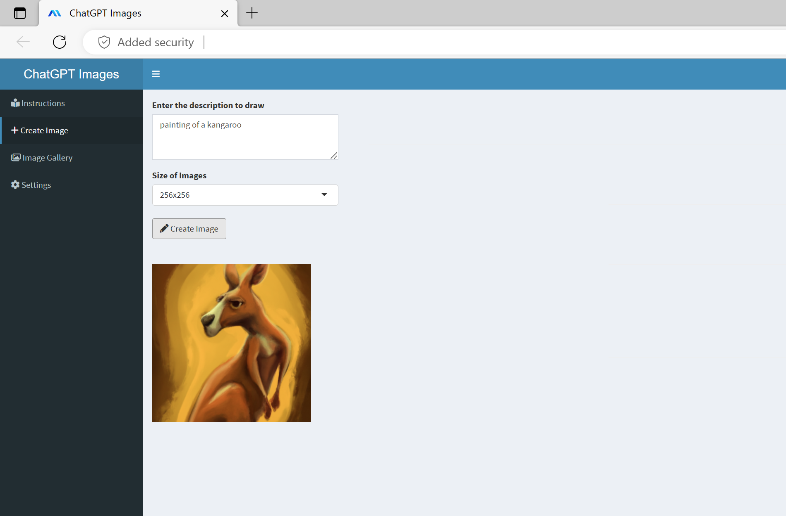
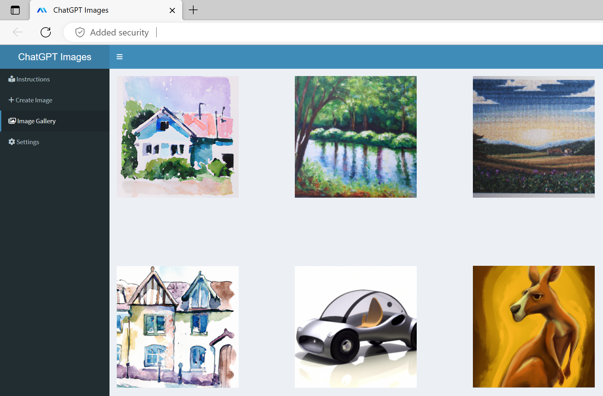

# ChatGPT Images - R Shiny
R Shiny Application/Package to create and manage images using ChatGPT.
<br /><br />

<!-- badges: start -->
&nbsp;&nbsp;
[](https://shiny.rstudio.com)&nbsp;&nbsp;
&nbsp;&nbsp;
[](https://github.com/analyticsinmotion/chatgpt-images-r-shiny/actions/workflows/R-CMD-check.yaml)&nbsp;&nbsp;
[](https://github.com/analyticsinmotion/chatgpt-images-r-shiny/blob/main/LICENSE.md)&nbsp;&nbsp;
&nbsp;&nbsp;
[](https://github.com/analyticsinmotion/chatgpt-images-r-shiny/actions/workflows/test-coverage.yaml)&nbsp;&nbsp;
[](https://github.com/analyticsinmotion/chatgpt-images-r-shiny/actions/workflows/lintr.yml)&nbsp;&nbsp;
  <!-- badges: end -->

<!-- DESCRIPTION -->
## 1. Description
This application provides a simple web interface using Shiny to dynamically create images using OpenAI's ChatGPT models.


https://user-images.githubusercontent.com/52817125/218607251-d3ca7d49-f95f-4f36-8d74-752755bba3d1.mp4


<!-- GETTING STARTED -->
## 2. Getting Started
### 2.1 Dependencies
- Requires an OpenAI API Key (create an account and get API Key at <a href="https://chat.openai.com">https://chat.openai.com</a>)
- Requires the following packages:
  - shiny (>= 1.7.4)
  - golem (>= 0.3.5)
  - shinydashboard (>= 0.7.2)
  - openai (>= 0.3.0)
  - config (>= 0.3.1)
  - testthat (>= 3.0.0)
 
Please be aware of the [costs](https://openai.com/pricing) associated with using the OpenAI API when utilizing this project. 
 
### 2.2 Launching the Project

*Step 1* - Download the repository
<br />

*Step 2* - Open the project file chatgptimages.Rproj in RStudio
<br />

*Step 3* - Open the run_dev.R file in the dev directory (see Section 5 - Directory Structure if you are unable to locate)
<br />

*Step 4* - Run the run_dev.R file
<br />

Your default browser should open with the application
<br /><br />
    
<!-- INSTRUCTIONS -->
## 3. Instructions

The application has 4 basic screens to navigate - *Instructions*, *Create Image*, *Image Gallery*, and *Settings*.
<br /><br />

<br /><br />

### 3.1 Instructions Page
The instructions page is the default page that is shown when the application is run. It provides a complte run down of how to use the application.
<br />

<!--  -->

<br /><br />

### 3.2 Settings: - Enter API Key
In order to use this application a user must have an API Key from OpenAI. This can be done by creating an account from the following link: https://chat.openai.com. Once a user has got their API Key it can be added into the app and saved.
<br />

<!--  -->

<br />

**Please Note:** Depending on how this application is deployed, the API Keys will be kept in persistant storage. That means they will persist until overwritten, even after shutting down the app. If you are deploying this in a production environment please read the [Best practices for API packages](https://cran.r-project.org/web/packages/httr/vignettes/api-packages.html).
<br /><br />

### 3.3 Create Image
In the text box, type a description of the image you want ChatGPT to create.
The generator can create images in 3 different sizes: 
- 256x256
- 512x512
- 1024x1024. <br />

This can be selected in the dropdown box.
Then click the *Create Image* button. In 2-3 seconds the image will appear.
<br />

<!--  -->

<br /><br />

### 3.4 Image Gallery
All images that a user creates will be stored in the gallery. 
<br />


<br /><br />

<!-- Top 10 Image Creation Ideas -->
## 4. Top 10 Image Creation Ideas
If you are stuck for inspiration try one of these creation prompts:
```
1. Oil painting mountains and water
2. watercolor landscape
3. Pointillism trees
4. Futuristic cars
5. Mona Lisa laughing
6. An astronaut riding a horse in a photorealistic style
7. Fantasy artwork
8. Family Christmas photo
9. Painting of a kangaroo cartoon style
10. A funny image that makes me laugh
```

<br /><br />

<!-- DIRECTORY STRUCTURE -->
## 5. Directory Structure

This project follows the golem/R Packages architecture.

    chatgptimages
    ├── DESCRIPTION
    ├── NAMESPACE
    ├── LICENSE
    ├── LICENSE.md
    ├── chatgptimages.Rproj
    ├── .Renviron
    ├── R
    │   ├── app_config.R
    │   ├── app_server.R
    │   ├── app_ui.R
    │   ├── fct_get_filename.R
    │   ├── fct_get_images.R  
    │   ├── fct_get_url.R
    │   ├── fct_set_apikey.R
    │   ├── golem_utils_server.R
    │   ├── golem_utils_ui.R
    │   ├── mod_create_image.R
    │   ├── mod_input_apikey.R
    │   ├── mod_show_gallery.R
    │   ├── mod_show_instructions.R
    │   └── run_app.R
    ├── tests
    │   ├── testthat
    │   │   ├── test-golem_utils_server.R
    │   │   ├── test-golem_utils_ui.R
    │   │   ├── test-golem-recommended.R
    │   │   ├── test-mod_create_image.R
    │   │   ├── test-mod_input_apikey.R
    │   │   ├── test-mod_show_gallery.R
    │   │   └── test-mod_show_instructions
    │   ├── spelling.R
    │   ├── app_configtestthat.R
    ├── dev
    │   ├── 01_start.R
    │   ├── 02_dev.R
    │   ├── 03_deploy.R
    │   └── run_dev.R
    ├── inst
    │   ├── app
    │   │   └── www
    │   │       └── favicon.ico
    │   ├── golem-config.yml
    │   └── WORDLIST
    └── man
        └── run_app.Rd


<!-- Best Practices for API Key Safety -->
## 6. Best Practices for API Key Safety

Your OpenAI APIKEY key/s should be kept secure and private at all times.

Please follow the best practices guide for API security from OpenAI 
<br />
<a href="https://help.openai.com/en/articles/5112595-best-practices-for-api-key-safety">https://help.openai.com/en/articles/5112595-best-practices-for-api-key-safety</a>
